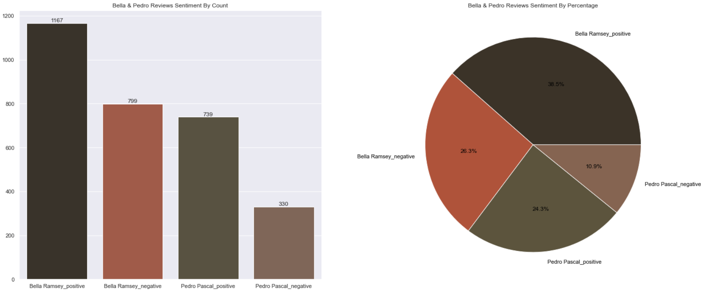
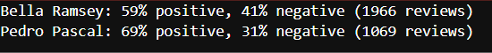
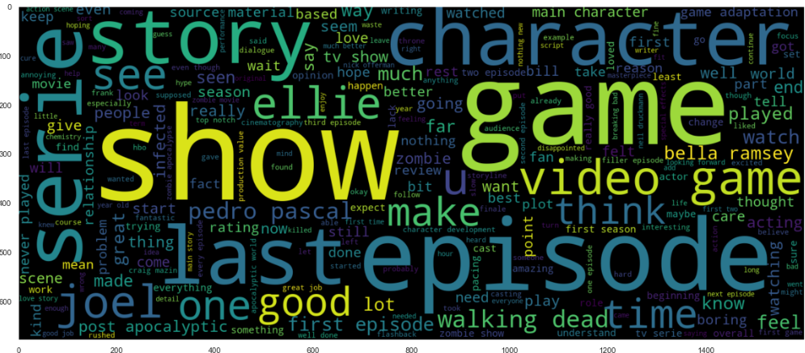
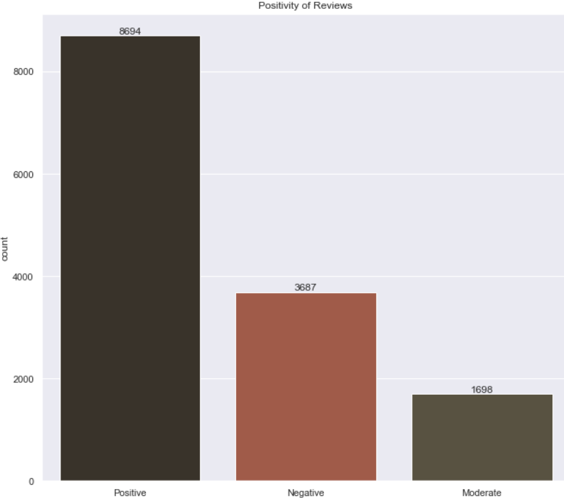
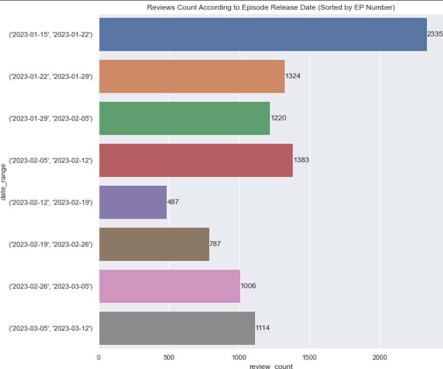
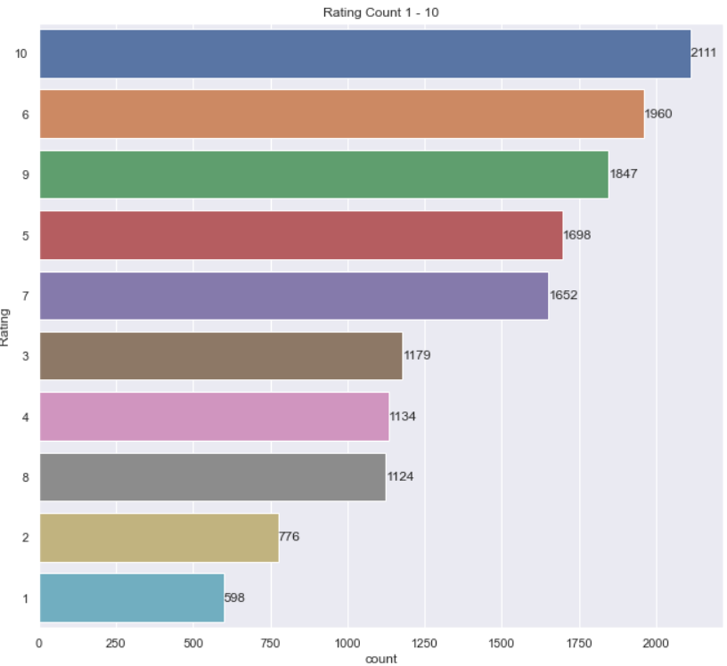

#  Scraping and Advanced EDA and NLP Analysis on IMDB "The Last of Us" Reviews 
The series TLOU has become very trendy these days and there have been many contradictions about the main actors of this series, **Pedro Pascal** and **Bella Ramsey**. In this project, I tried to understand the critics' feelings about the acting of these two actors based on the reviews of this series on IMDB

## Project Overview :

### - Scraping TLOU Reviews from IMDB
I used Beautifulsoup and Selenium to scrape data from TLOU review's page

###  - Understanding the data
    - Shape of the data
    - Check column dtypes
    - Check is there any null values
### -  Data Preprocessing  
    - Convert Date Format to Datetime
    - Convert Rating Format to Int
 
### - Feature Engineering 
    - Create Sentiment by Review Rating
    
### - Analyzing Reviews 
    - What Rating Did the Users Give to the Series? 
    - Whats the Min, AVG, Max of Ratings?
    - What's the number of reviews according to episodes release date?
    - Review Sentiments Based on Rating
    - What's the Most Frequent Words in the Reviews?
    
### - Extract Reviews with Bella Ramsey and Pedro Pascal Mentions and Apply Sentiment Analysis on Them
